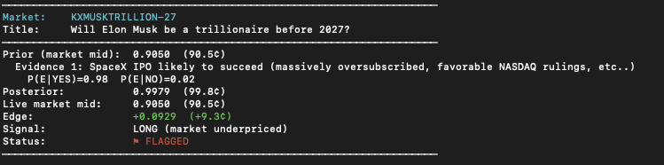

# Kalshi Prediction Markets Trader

A Python toolkit for monitoring live Kalshi prediction markets and running Bayesian fair-value estimation against live prices.

Built as a portfolio project for quantitative trading roles requiring hands-on prediction markets experience.

---

## What It Does

1. **Market Scanner** — pulls live market data from Kalshi's public REST API and prints a clean table of titles, bid/ask prices, mid-prices, and volume
2. **Google Sheets Sync** — auto-pushes market data to a Google Sheet on a configurable interval
3. **Bayesian Pricer** — takes a live market price as a prior, applies Bayes' Rule given new evidence, and flags markets where the posterior diverges meaningfully from the market price

See [`METHODOLOGY.md`](METHODOLOGY.md) for a full explanation of the Bayesian approach and worked example.

---

## Project Structure

```
kalshi_trader/
├── .env.example          # Template — copy to .env and fill in values
├── .gitignore
├── README.md
├── METHODOLOGY.md        # Bayesian approach explained
├── requirements.txt
├── config.py             # Loads settings from .env
├── kalshi_client.py      # Kalshi REST API wrapper
├── market_scanner.py     # Live market data + display table
├── sheets_sync.py        # Google Sheets auto-update
├── bayesian_pricer.py    # Bayesian fair-value engine
├── run_all.py            # Entry point
└── samples/
    └── sample_output.txt # Example terminal output
```

---

## Setup

### 1. Clone and install dependencies
```bash
git clone https://github.com/yourusername/kalshi-trader.git
cd kalshi-trader
pip install -r requirements.txt
```

### 2. Configure environment
```bash
cp .env.example .env
```

The market scanner and Bayesian pricer work with **no configuration at all** — Kalshi's market data endpoint is public and requires no API key.

Only fill in `.env` values if you want:
- **Google Sheets sync** → set `GOOGLE_CREDENTIALS_PATH` and `SPREADSHEET_ID`
- **Authenticated endpoints** (order placement) → set `KALSHI_API_KEY_ID` and `KALSHI_PRIVATE_KEY_PATH`

### 3. Google Sheets setup (optional)
1. Go to [Google Cloud Console](https://console.cloud.google.com/)
2. Create a project → Enable **Google Sheets API** + **Google Drive API**
3. Create a **Service Account** → download JSON credentials file
4. Share your target Google Sheet with the service account email
5. Set `GOOGLE_CREDENTIALS_PATH` and `SPREADSHEET_ID` in `.env`

---

## Usage

```bash
# Scan live markets and print table
python market_scanner.py

# Run Bayesian demo (no API call, no config needed)
python bayesian_pricer.py --demo

# Run Bayesian pricer interactively (pick any live ticker)
python bayesian_pricer.py

# Sync to Google Sheets (runs once then exits)
python sheets_sync.py --once

# Sync to Google Sheets (loops every 60s)
python sheets_sync.py

# Run scanner + Bayesian demo together
python run_all.py

# Run everything including Sheets sync
python run_all.py --sheets
```

---

## Sample Output



See [`samples/sample_output.txt`](samples/sample_output.txt) for additional example terminal output from both the scanner and Bayesian pricer.

---

## Extending This Project

- **WebSocket streaming** — replace REST polling with Kalshi's WebSocket feed for real-time price updates
- **Automated evidence ingestion** — pipe in BLS CPI releases, Fed speech NLP sentiment, or Polymarket prices as structured evidence inputs
- **Cross-platform arbitrage** — compare Kalshi and Polymarket prices on equivalent markets
- **Backtesting** — store historical snapshots and evaluate whether flagged edges were predictive of subsequent price moves
- **Kelly sizing** — add position sizing to flagged signals: `f* = (bp − q) / b`
